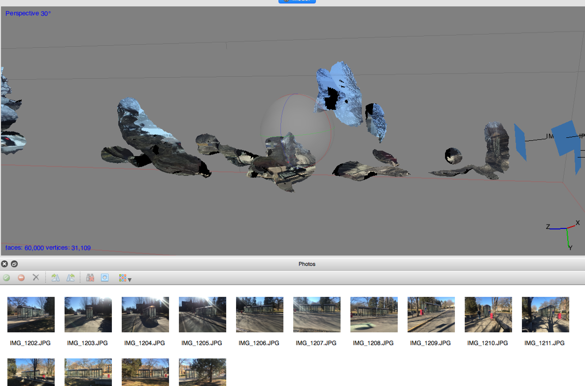
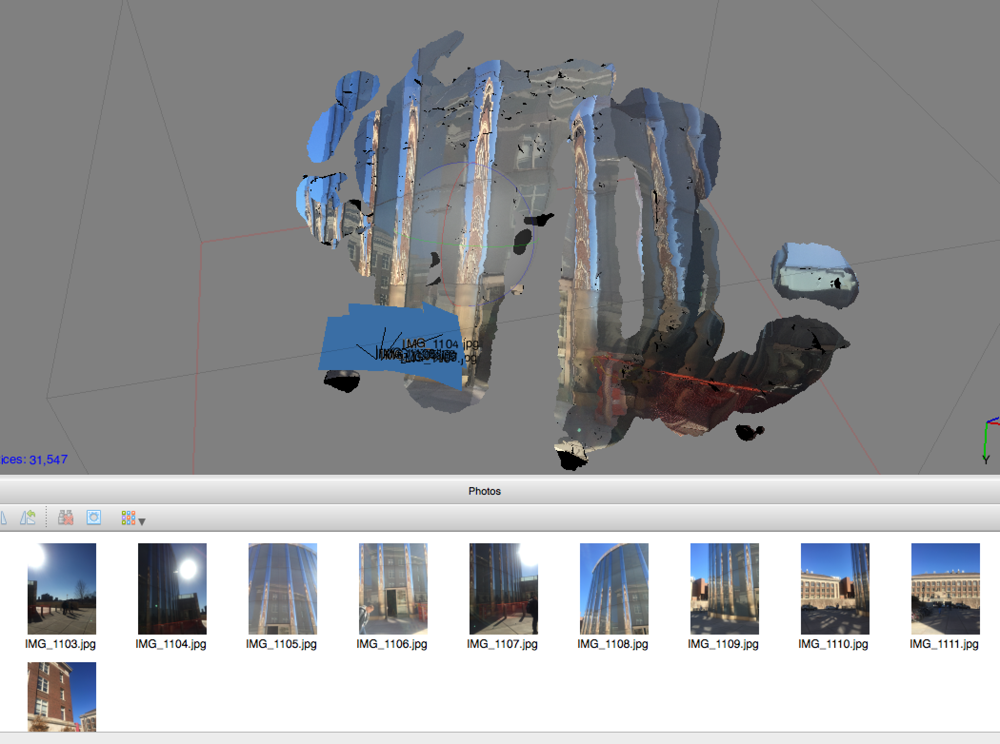
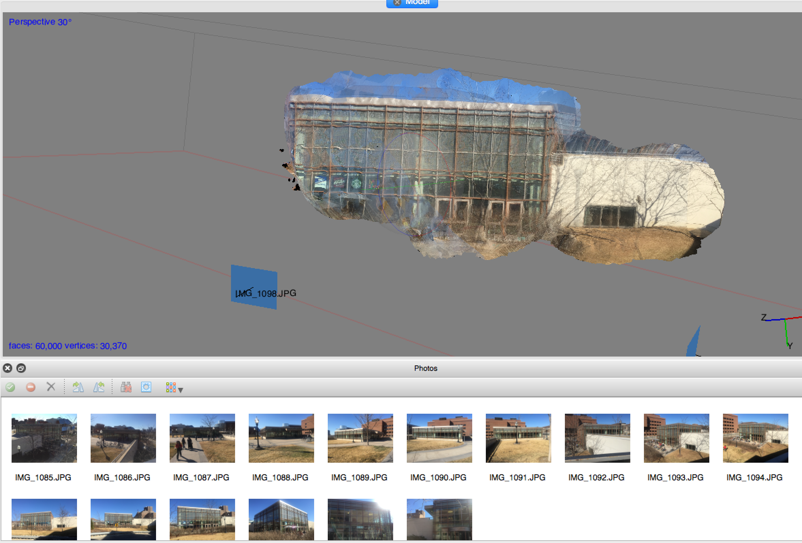

#READING FACADES DAY 2 - 3.10.15

###LEARNING PHOTOGRAMMETRY
Today, we experimented with the software Photoscan.  The process entailed taking a series of photos of the exterior of Rapson Hall as a group then inputting the photos into the Photoscan software.  The software, using a series of algorithims that identifiy common points within the images, interprets the photographs three-dimensionally.   Results, in terms of wholeness and correctness of the actual forms, varied greatly throughout the class.  We identified the methods that each of us employed in photographing the spaces, finding that more computer-like methods tended to yield results that more closely resembled the buildings as we perceive them.  Below is an image of the east side of Rapson Hall as the computer perceived the photos I took.

The computer interpretations often have a warped appearance as it responds to several factors, including variations in lighting, coloring, transparency, and reflectivity.  After reviewing findings, each student explored more specific material properties in the surrounding environment.  Below illustrates computer interpretations of various architectural qualities.

####TRANSPARENCY

####REFLECTIVITY

####MASONRY ENTRY

####REPETITION

###LOGGING

Using GitHub as an online file repository is equally fundamental this week.  In the process of logging work and sharing data, markdown is used then pushed to GitHub through Terminal on Mac.  

