#READING FACADES DAY 1 - 3.9.15

###GIT
This is a method of storing and sharing information with the ability to document process.  This is for a github page, using Markdown to communicate.

###PHOTOGRAMMETRY
Photogrammetry is used to retrieve real data points from photographs.  Difficulties lie where there are reflective surfaces and replicated patterns. This allows us to move beyond representational to speculative.  Real world application is involved in facial recognition and keeping files of real world objects.  It also allows to layer information not immediately or explicitly by an individual.  It also allows us to take a snapshot of the current state of a building or object that is prone to be in flux.

#READING FACADES DAY 2 - 3.10.15

###LEARNING PHOTOGRAMMETRY
Today, we experimented with the software Photoscan.  The process entailed taking a series of photos of the exterior of Rapson Hall as a group then inputting the photos into the Photoscan software.  The software, using a series of algorithims that identifiy common points within the images, interprets the photographs three-dimensionally.   Results, in terms of wholeness and correctness of the actual forms, varied greatly throughout the class.  We identified the methods that each of us employed in photographing the spaces, finding that more computer-like methods tended to yield results that more closely resembled the buildings as we perceive them.  Below is an image of the east side of Rapson Hall as the computer perceived the photos I took.

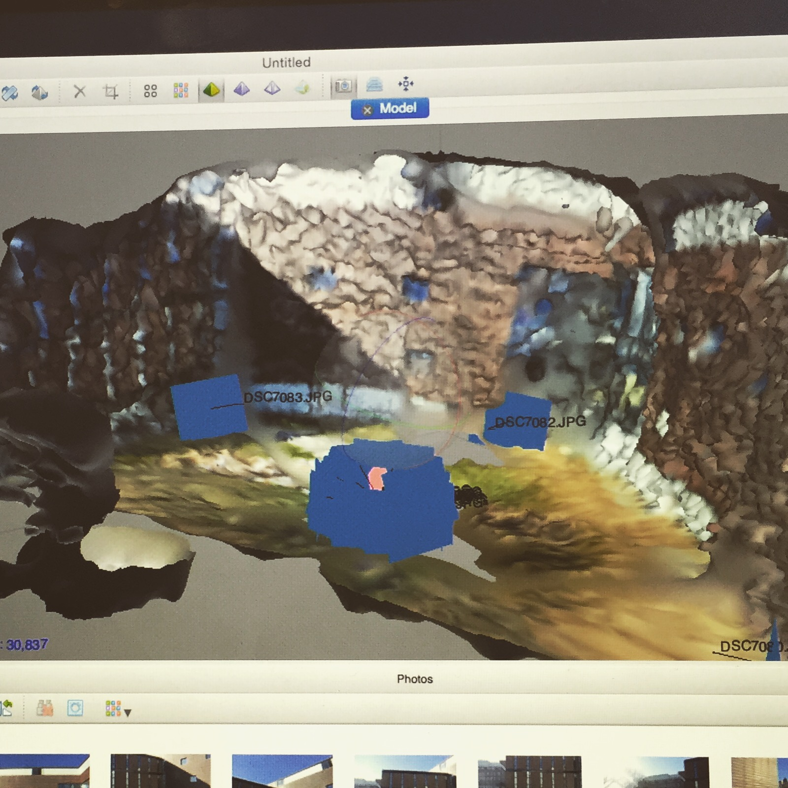

The computer interpretations often have a warped appearance as it responds to several factors, including variations in lighting, coloring, transparency, and reflectivity.  After reviewing findings, each student explored more specific material properties in the surrounding environment.  Below illustrates computer interpretations of various architectural qualities.

####TRANSPARENCY

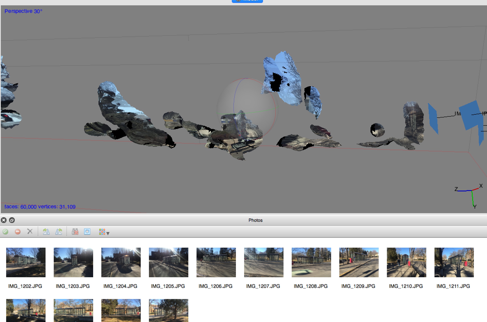

####REFLECTIVITY

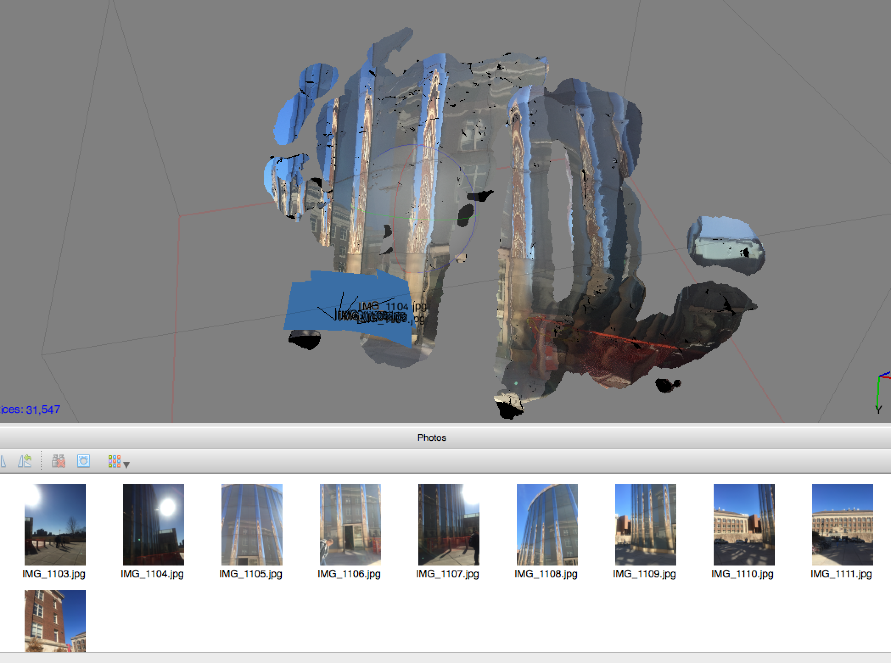

####MASONRY ENTRY

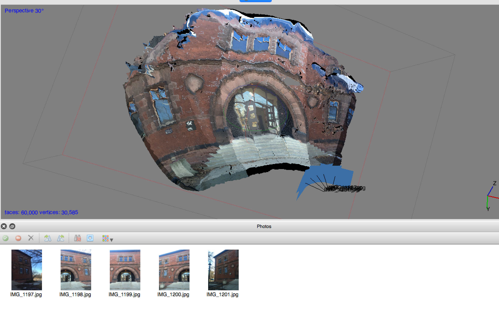

####REPETITION

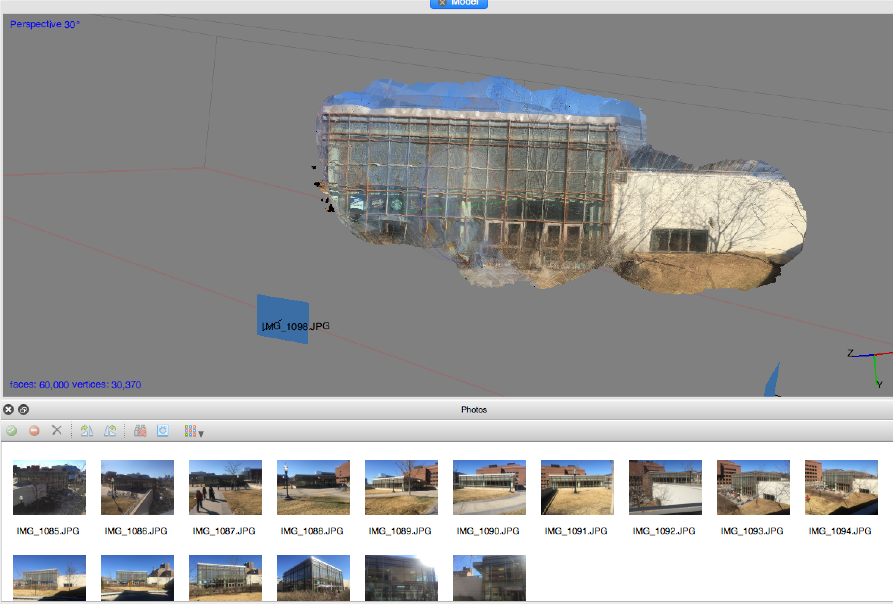

###LOGGING

In the process of logging work and sharing data, markdown is used then pushed to GitHub through Terminal on Mac.  

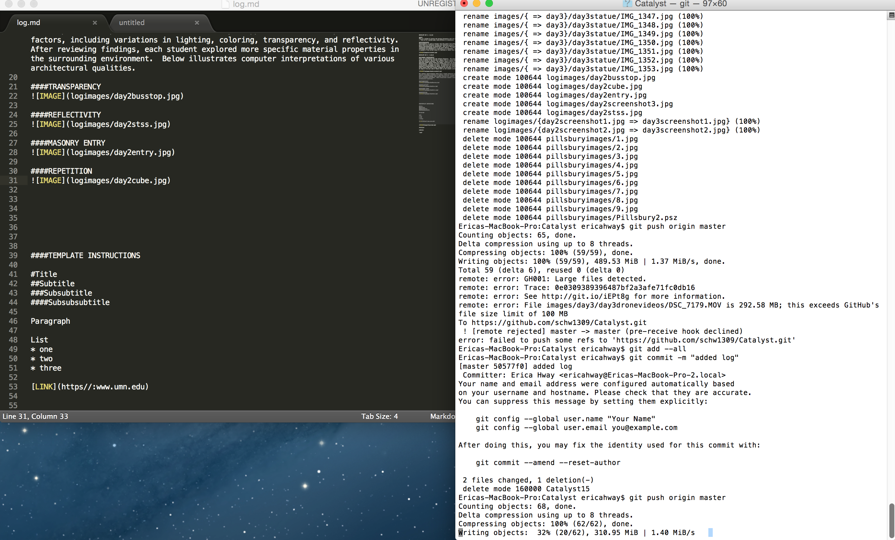

#DAY 3 - 3.11.15

###EXPLORING ENTRIES

Today, we looked at Pillsbury Hall entry and the Rec Center entry as a class with various methods of photographing.  We found that transversing around the building and through the building (into the entry) at Pillsbury had very different results.  Transversing around picked up more contextual information and blended together vegetation elements and building elements while transversing through the entry yielded greater more information within the focal point (the entry) and less of the contextual elements.  

####TRANSVERSING AROUND 

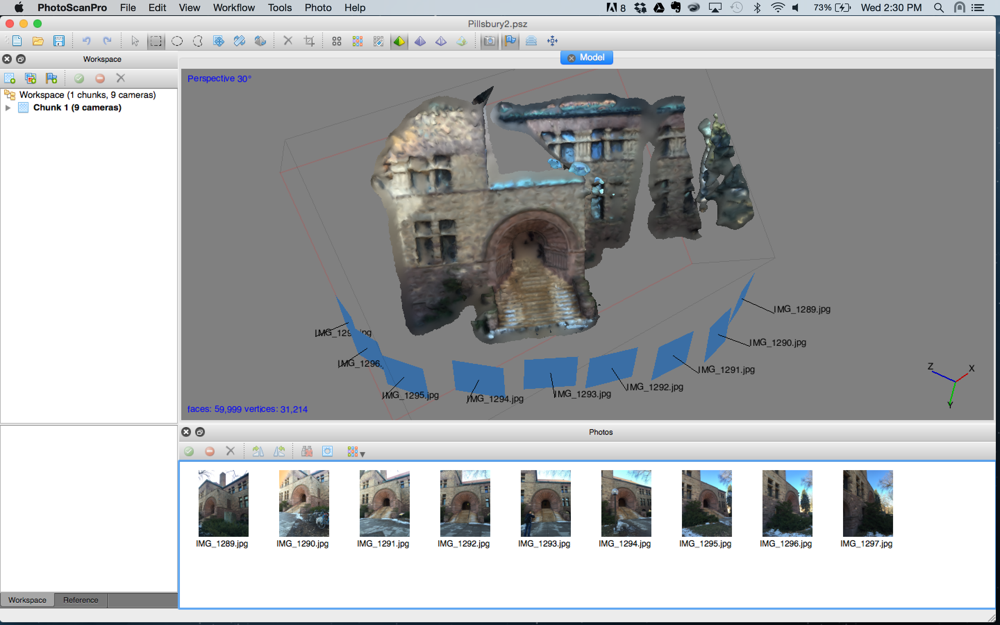

#### TRANSVERSING THROUGH

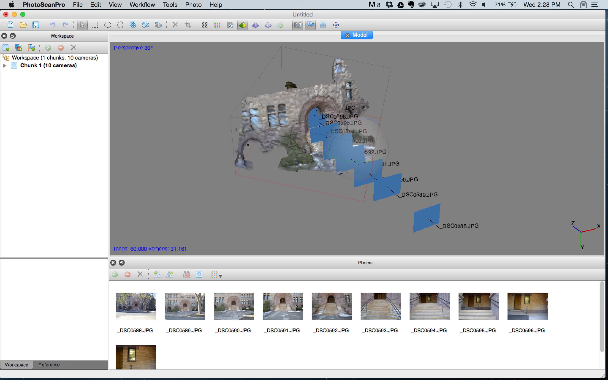

###DRONE

We also took the drone out for the first time.  The opportunities the drone brings are being able to move around a building completely and get every vantage point.  I was surprised at how high it is able to go and how stable and smooth the videos are from the GoPro.

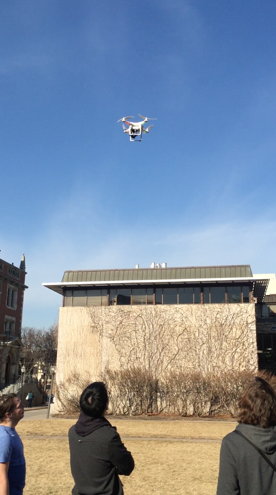

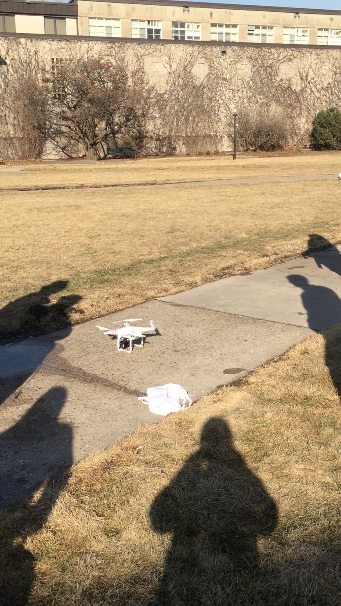

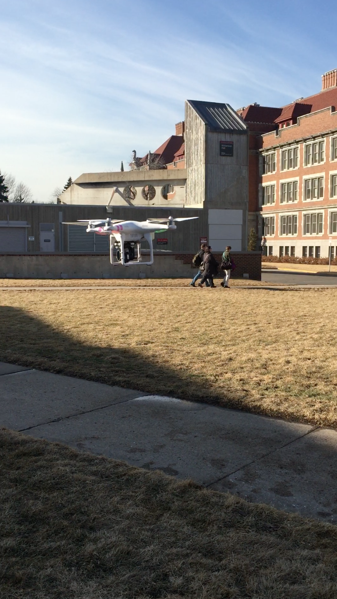

#DAY 4 - 3.12.15

###DISCUSSION QUESTIONS
* Why build a model?
* Spectrum of representation + speculation?
* What new insights (practical + conceptual) into facades can CV give us?
* What are the main ideas driving your work?
* Relationship between you and computer in design (dragging design)
* The dichotomy between manual and automated design
* Difference between decimation + drippy?
* What role does movement play in process? To what extent are the models about movement? About vision?
* Are we modeling affordances? Who are you to tell a computer what to do?

###EXPLORING PERIPHERY
As humans walking through space, we subconsciously percieve "borders" in the spaces around us and "transitions" to new spaces.  As we travel through these spaces, we often are focused on specific points ahead of us while our mind implicitely takes in information in our periphery.  Jeremy and I explored how our environment that we don't consciously understand is understood and perceived by computer vision.  We traveled through a series of what we felt implicitely were distinct spaces along a route.  Then, we took a series of photos in each of these spaces and used photogrammetry to see how the computer's unbiased perscpective would generate the 3D environment.  We were surprised to see how the computer often left out our focal point and only modeled our periphery.  

In this exploration, we were also led to question our perception of what a facade is.  Typically, we view a facade as a stand alone face face of a building distinct from its surrounding environment.  However, it became apparent in our exercise that that our context is more than separate faces of building.  Through the interactions of various materials, lighting conditions, and geometries, the boundaries percieved in our periphery are complex combinations of distinct facades and other elements.  In the PhotoScan mesh, partial buidling faces merge with trees and other landscape elements to form a more amorphous geometry of our periphery.  While we inherently understand the true geomtries of our spaces through our built-in database and understanding of the laws of physics, photogrammetry potentially renders a more realistic form of our periphery and what we subconsciously perceive.  Furthermore, by decimating the mesh, we are able to see more simplistically how the faces and elements of our environment interact to form boundaries.

###SITE

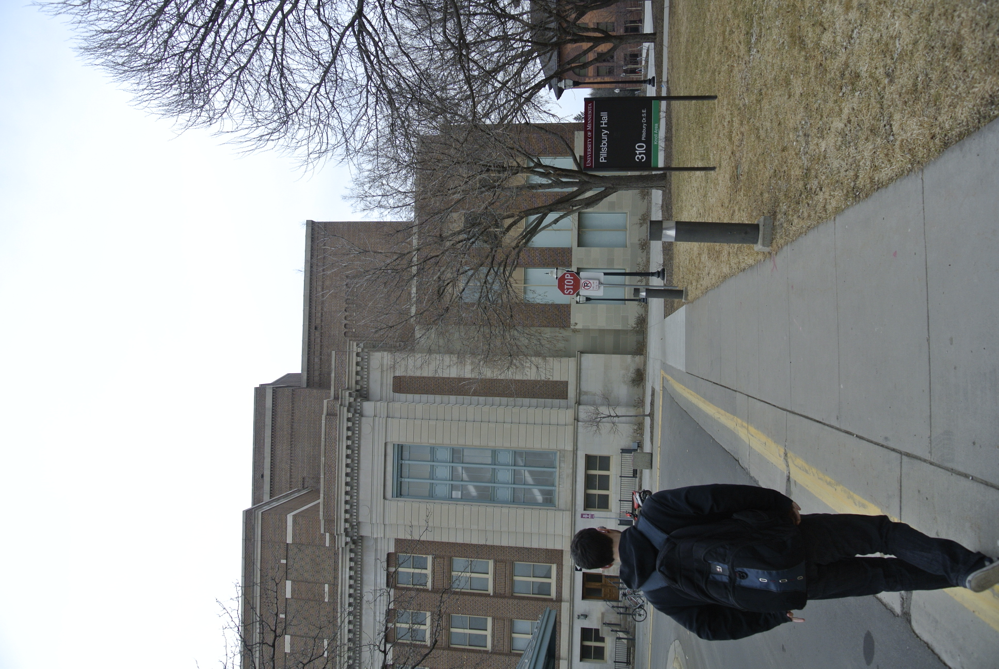

###PHOTOSCAN WITH TEXTURE

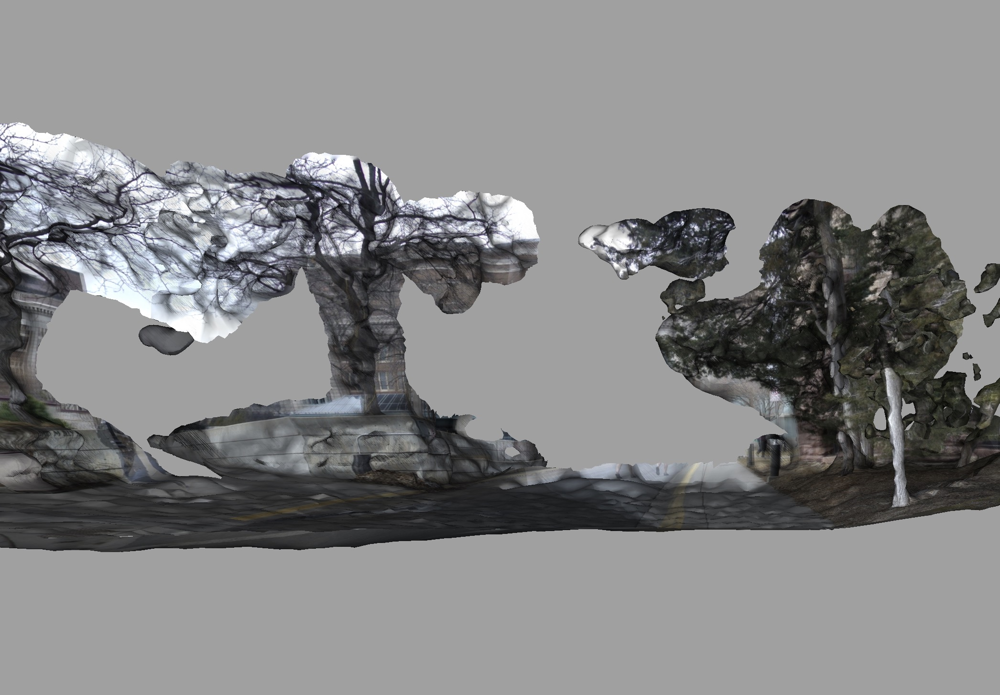

###MESH

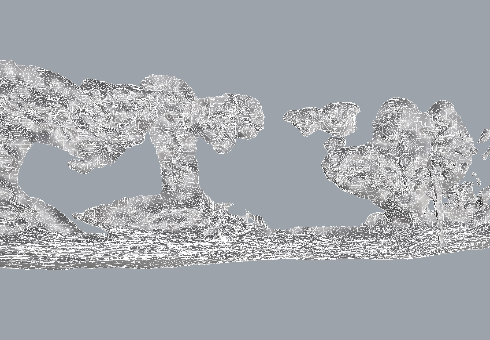

###DECIMATION

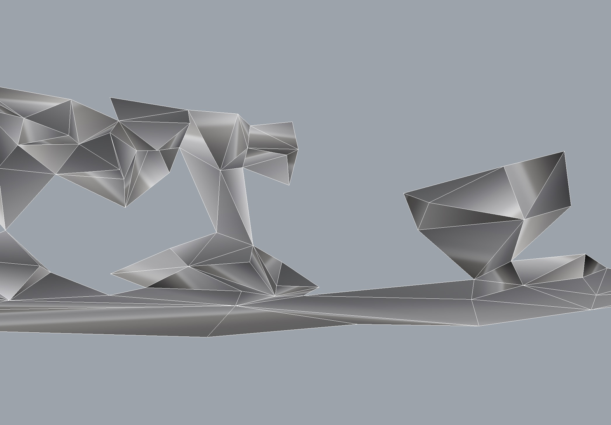

####TEMPLATE INSTRUCTIONS 

#Title
##Subtitle
###Subsubtitle
####Subsubsubtitle

Paragraph

List
* one
* two
* three

[LINK](https//:www.umn.edu)

*Italics*

**Bold**

`code`

